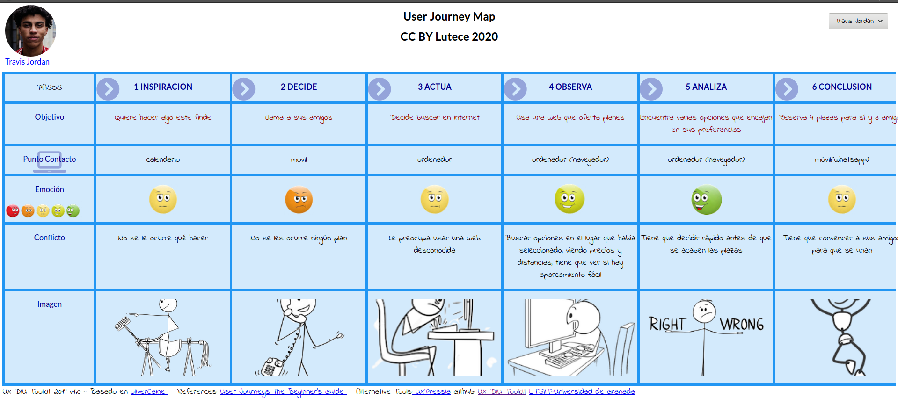
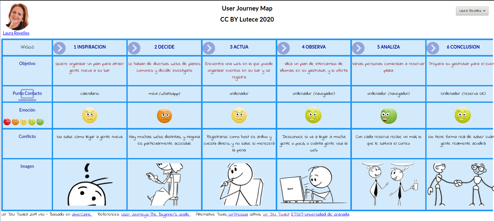

## DIU - Practica1, entregables

- Desk research: Análisis Competencia 
- 2 Personas 
- 2 User Journey Map  ( 1 por persona)
- Revisión de Usabilidad 

# Proceso de Diseño 

## Paso 1. UX Desk Research & Analisis 

 1.a Competitive Analysis
-----

Se ha estudiado el caso de MeetUp, EatWith y Artery. El objetivo común de estas páginas es compartir experiencias de ocio, si bien EatWith se enfoca más en compartir experiencias culinarias y los otros dos son más de variedad (actividades deportivas, de formación, de eventos para compartir experiencias y conocer gente...). Estos eventos suelen estar publicados por el mismo *host* del evento (o en el caso de ***Artery*** el *artista* también) y permiten inscribirse a este, teniendo así una lista de asistentes. Además, cada evento tiene su descripción y una zona resumida que te dice el día, hora, precio (si procede), y localización.
 

 |Características |Artery |MeetUp     |EatWith     |
 |----------------|-------|-----------|------------|
 |  *Formato*            | Web   | Web + App | Web + App  |
 |  *Búsqueda (keywords)*| ✔     | ✔         | ✔          |
 |  *Búsqueda(avanzada)* | ✔     | ✔         | ✔          |
 |  *Creación de eventos*| ✔     | ✔         | ✔          |
 |  ***Visualización de eventos:*** |      |   |           |
 |  *->Opción de eventos gratis*| ✘      | ✔         | ✘          |
 |  *->Opción de eventos de pago*| ✔     | ✔         |        ✔   |
 |  *->Miembros participantes* | ✘     | ✔   |✘          |
 |  *-> Marcar como favorito* | ✘     | ✔   | ✘          |
 |  *-> Mapa de localización* | ✔     | ✔   | ✔          |
 |  *-> Adición de invitados* | ✘      |  ✔   | ✔          |
 |  *Fichas de grupos o individuos*|✔ (Permite contacto con host y con artista)      | ✔(Permite contacto y seguir eventos de este)         | ✔ (Permite reserva directa y contacto)         |
 |  *Centro de ayuda* | ✔     | ✔   | ✔          |
 |  *Contacto por chat online* | ✔     | ✔   | ✔          |
 |  *Versión en español* | ✘     | ✔   | ✔          |
 
La que hemos elegido en nuestro caso es MeetUp ya que las experiencias son variadas, y tiene más características que las demás. Además, es la más accesible y la que más gente usa.

 1.b Persona
-----
 

 1.c User Journey Map
----

