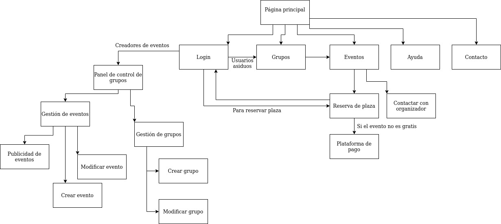

## Paso 2. UX Design  

 2.a Feedback Capture Grid
----

>>> Comenta con un diagrama los aspectos más destacados a modo de conclusion de la práctica anterior,

 Interesante | Críticas     
| ------------- | -------|
| Crear un grupo es bastante fácil (al menos hasta llegar al proceso de pago)| Homepage para usuarios registrados está mal estructurado.|
|Información de eventos a golpe de vista| Búsqueda de eventos pobre y poco amigable.|
|Fácil de encontrar por los buscadores|No hay versión para imprimir tampoco se puede imprimir la página del evento correctamente.|
|  **Preguntas** | **Nuevas ideas**|
|Pagar por publicitar eventos por la página o anuncios de la web.|Usando geolocalización, que se avise de eventos cercanos a la ubicación del usuario|
|Sistema de verificación para no crear eventos “falsos”|Grupo de Whatsapp/Telegram/Otra aplicación de mensajería integrada o externa para coordinación.|
|Sistema de valoración
  
  
  
>>> ¿Que planteas como "propuesta de valor" para un nuevo diseño de aplicación para economia colaborativa ?
>>> Problema e hipótesis
>>> (150-200 caracteres)

El problema que se ve aquí es que no queda muy claro el objetivo de MeetUp, así que trataremos de hacer más llamativos los eventos y las posibilidades que da este tipo de aplicaciones.

 2.b Tasks & Sitemap 
-----

>>> Definir "User Map" y "Task Flow" ... 

||Grupo 1 (Creadores)|Grupo 2 (Usuarios Asiduos)|Grupo 3 (Usuarios casuales)|
|-|------------------|--------------------------|---------------------------|
|Crear un grupo|M|||
|Crear un evento|H|||
|Unirse a un grupo|L|M|L|
|Unirse a un evento|M|H|M|
|Registrarse|L|L|L|
|Mandar un mensaje|M|M|L|
|Hacer una valoración|L|M|L|
|Publicitar un evento|L|||

 2.c Labelling 
----

>>> Identificar términos para diálogo con usuario  

Término | Significado     
| ------------- | -------
  Login  | Acceder a plataforma
  Pagina principal| Pagina donde se llega desde el buscador
  Grupos| Conjunto específico de personas que hacen eventos
  Eventos| Reuniones donde se hablan de temas concretos
  Ayuda| Sección para resolver aquellas dudas sobre la página
  Contacto| Sección para contactar con el webmaster
  Reserva de plaza| Solicitud para participar en el evento
  Plataforma de pago| Lugar donde se redirecciona en caso de requerir pago
  Contactar con el organizador| Lugar de la página donde aclara dudas o referir incidentes al organizador del evento
  Panel de control de grupos| Zona exclusiva para organizadores o creadores de eventos para gestionar los grupos que dirigen y los eventos correspondientes
  Gestión de grupos| Zona de organizadores/creadores de eventos para gestionar los grupos pertenecientes.
  Gestión de eventos| Zona de gestión para organizadores dirigido a crear, notificar o modificar eventos
  Crear (evento/grupo)| Permite crear un nuevo grupo(o evento)
  Modificar (evento/grupo)| Permite modificar los datos o eliminar un grupo (o evento)
  Publicidad de eventos| Zona de gestión de marketing de eventos a través de agencias de publicidad por Internet

 2.d Wireframes
-----

### Página principal

>>> Plantear el  diseño del layout para Web/movil (organización y simulación ) 
