## Paso 2. UX Design  

 2.a Feedback Capture Grid
----

 Interesante | Críticas     
| ------------- | -------|
| Crear un grupo es bastante fácil (al menos hasta llegar al proceso de pago)| Homepage para usuarios registrados está mal estructurado.|
|Información de eventos a golpe de vista| Búsqueda de eventos pobre y poco amigable.|
|Fácil de encontrar por los buscadores|No hay versión para imprimir tampoco se puede imprimir la página del evento correctamente.|
|  **Preguntas** | **Nuevas ideas**|
|Pagar por publicitar eventos por la página o anuncios de la web.|Usando geolocalización, que se avise de eventos cercanos a la ubicación del usuario|
|Sistema de verificación para no crear eventos “falsos”|Grupo de Whatsapp/Telegram/Otra aplicación de mensajería integrada o externa para coordinación.|
|Sistema de valoración|Posibilidad de clasificar a los asistentes según sean VIPs, prensa....|
|Poder compartir los eventos vía RRSS|Posibilidad de "leer la página" para ciegos
  
  
  
#### Propuesta de valor

El problema que se ve aquí es que no queda muy claro el objetivo de MeetUp, así que trataremos de hacer más llamativos los eventos y las posibilidades que da este tipo de aplicaciones.
La aplicación se basa en un conjunto de grupos que se reunen en una localización, y estos hacen una serie de eventos. Por ello, la aplicación deberá visualizar información sobre los grupos, y cada uno de los eventos que hacen. 
Cualquier persona que entre a la aplicación (a partir de ahora Usuario) podrá ver esos eventos y unirse a ellos. La aplicación requeriría que tal usuario se registre o se identifique (según haya entrado por primera vez o ya ha estado antes). Al haber posibilidad de que los eventos sean de paga, habría que permitir pasar por una plataforma de pago sencilla y fácil de usar. 
Una vez unido al evento este usuario tendría que estar al pendiente de posibles comunicaciones e incidencias, por lo que la app tendría que tener un sistema de notificaciones y la posibilidad de contactar con quien organiza el evento para cualquier cosa que tenga que ver con el grupo o el evento.
Una vez finalice el evento el usuario podría valorarlo y unirse al grupo que lo ha hecho por si quiere asistir a más eventos.

Por otra parte, habrá gente que tendrá que crear tales grupos y eventos (los llamaremos creadores). Estos podrán crear grupos y, a través de ellos, los eventos. Además deberían poder modificar sus parámetros en cualquier momento (o eliminarlos incluso)

Ambos tipos de personas (Creadores o usuarios) pueden tener inquietudes, dudas o problemas. Por ello podrían pedir ayuda a los creadores de la app a través de unas preguntas frecuentes o un forrmulario de contacto a la empresa. Además la empresa tiene unas bases legales que tienen que estar expuestas, como los Terminos y Condiciones y el Acerca de.

 2.b Tasks & Sitemap 
-----

||Grupo 1 (Creadores)|Grupo 2 (Usuarios Asiduos)|Grupo 3 (Usuarios casuales)|
|-|------------------|--------------------------|---------------------------|
|Crear un grupo|M|||
|Crear un evento|H|||
|Unirse a un grupo|L|M|L|
|Unirse a un evento|M|H|M|
|Registrarse|L|L|L|
|Mandar un mensaje|M|M|L|
|Hacer una valoración|L|M|L|
|Publicitar un evento|L|||
|Consultar ayuda|H|M|M|
|Solicitar contacto(grupo)|L|L|L|
|Solicitar contacto(app)|L|L|L|
|Pagar por un evento||M|M|
|Consultar "Acerca de..."|L|L|L|
|Consultar Términos y Condiciones|H|L|L|
|Consultar eventos|M|H|H|
|Consultar grupos|M|M|M|
|Consultar perfil de usuario|L|L|L|
|Consultar mensajes|M|M|M|
|Consultar notificaciones|H|M|M|

Nivel de uso: H (alto), M (medio), L (bajo)

## Sitemap

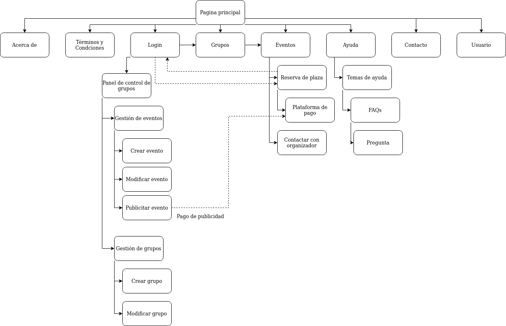

 2.c Labelling 
----

Término | Significado     
| ------------- | -------
  Login  | Acceder a plataforma
  Pagina principal| Pagina donde se llega desde el buscador
  Grupos| Conjunto específico de personas que hacen eventos
  Eventos| Reuniones donde se hablan de temas concretos
  Ayuda| Sección para resolver aquellas dudas sobre la página
  Contacto| Sección para contactar con el webmaster
  Reserva de plaza| Solicitud para participar en el evento
  Plataforma de pago| Lugar donde se redirecciona en caso de requerir pago
  Contactar con el organizador| Lugar de la página donde aclara dudas o referir incidentes al organizador del evento
  Panel de control de grupos| Zona exclusiva para organizadores o creadores de eventos para gestionar los grupos que dirigen y los eventos correspondientes
  Gestión de grupos| Zona de organizadores/creadores de eventos para gestionar los grupos pertenecientes.
  Gestión de eventos| Zona de gestión para organizadores dirigido a crear, notificar o modificar eventos
  Crear (evento/grupo)| Permite crear un nuevo grupo(o evento)
  Modificar (evento/grupo)| Permite modificar los datos o eliminar un grupo (o evento)
  Publicidad de eventos| Zona de gestión de marketing de eventos a través de agencias de publicidad por Internet
  Temas de ayuda| Tópicos o temas en los que se dividen las distintas posibles preguntas de la página de ayuda
  FAQs|Del Inglés "Frequently Asked Questions", se tratan de las preguntas frecuentes sobre tal tópico
  Pregunta| La página correspondiente a tal pregunta.
  Acerca de | Información sobre la aplicación y la empresa.
  Términos y Condiciones | Información y bases legales del us de la aplicación.
  Usuario| Perfil y algunos datos personales básicos del usuario.

 2.d Wireframes
-----

### Página principal
.png)

### Página de evento
.png)

### Página de grupo
.png)

### Página de ayuda
#### Principal
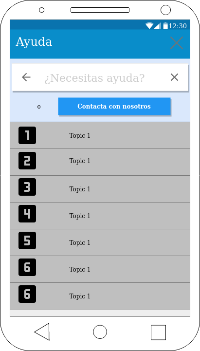

#### Topic

#### Pregunta
.png)

### Contacto (popup)
.png)

### Contacto con organizador (popup)
.png)

### Página de login

### Acerca de
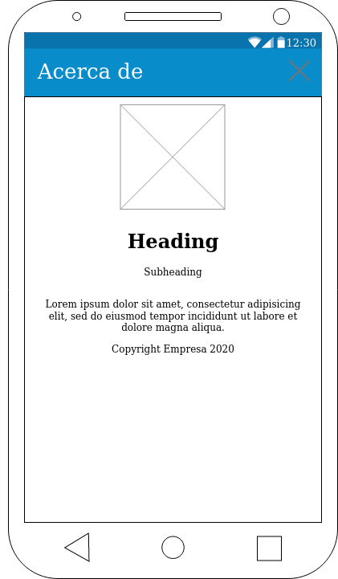

### Términos y Condiciones
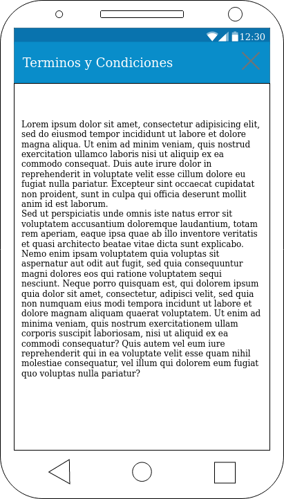

### Pestaña de Usuario

### Pestaña de Eventos
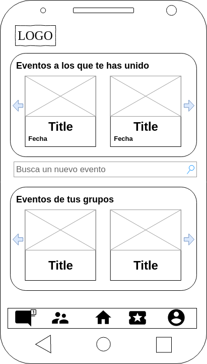

### Pestaña de Grupos
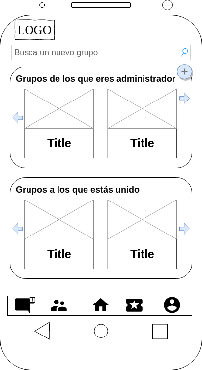

### Pestaña de Notificaciones

### Unirse a evento
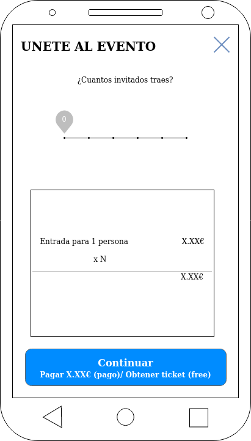

### Pagar evento
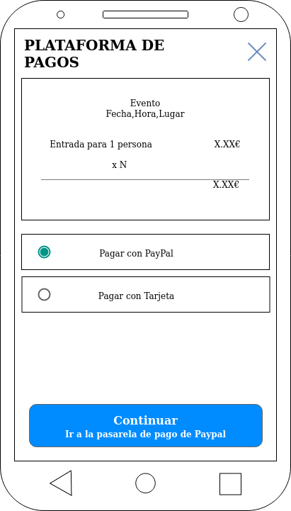

### Gestión de grupos (crear y modificar)

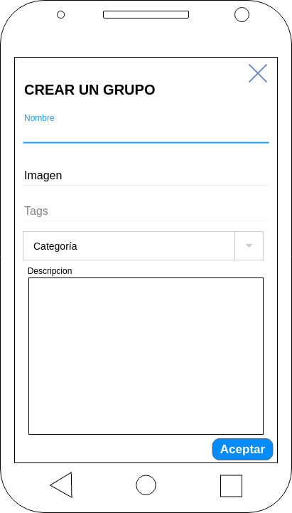

### Gestión de eventos (crear y modificar)

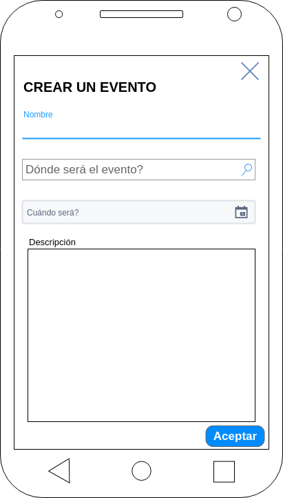
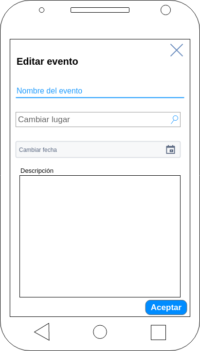
