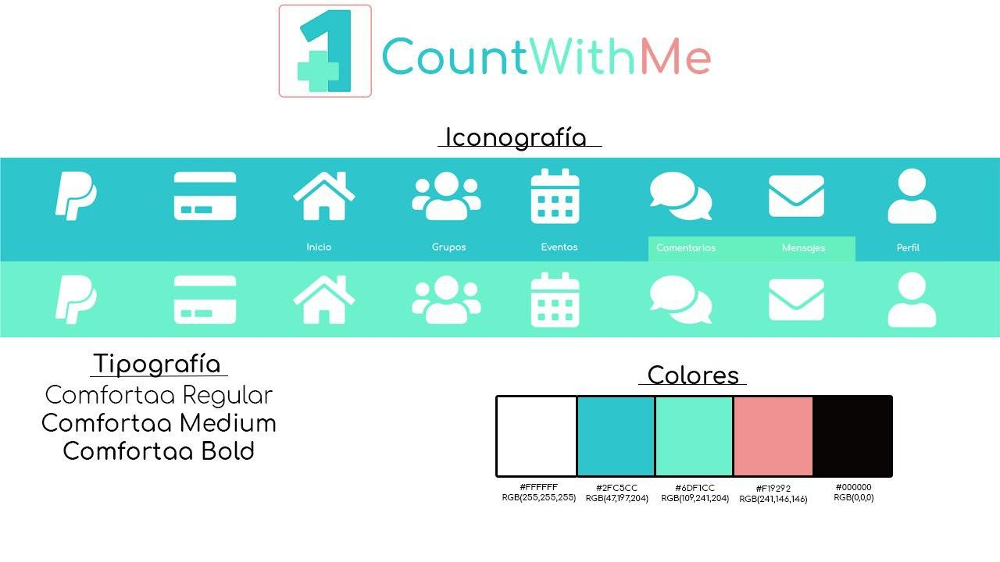

# DIU20
Prácticas Diseño Interfaces de Usuario 2019-20 (Economía Colaborativa) 

Grupo: DIU3_Lutece.  Curso: 2019/20 

Proyecto: Experiencias de compartir ocio. Propuesta de CountWithMe.

Descripción: Propuesta de aplicación de eventos basados en grupos afines a los intereses del usuario o en la creación de grupos; y en la creación y asistencia a eventos, con valoraciones y feedback sobre estos.

Logotipo: 

Miembros
 * :bust_in_silhouette:   José Manuel Navarro Cuartero     :octocat: ([@9pepe7](https://github.com/9pepe7))
 * :bust_in_silhouette:  Iván Valero Rodríguez     :octocat: ([@IvanitiX](https://github.com/IvanitiX))
----- 

En esta práctica estudiaremos un caso de plataforma de economía colaborativa y realizaremos una propuesta para su diseño Web/movil. Utilizaremos herramientas y entregables descritos en el siguiente CheckList (https://github.com/mgea/UX-DIU-Checklist) 

Qué es economia colaborativa: Martínez-Polo, J. (2019). **El fenómeno del consumo colaborativo: del intercambio de bienes y servicios a la economía de las plataformas**, *Sphera Publica, 1*(19), 24-46. http://sphera.ucam.edu/index.php/sphera-01/article/view/363/14141434

# Proceso de Diseño 

## Paso 1. UX Desk Research & Analisis 

 1.a Competitive Analysis
-----

Se ha estudiado tres páginas relacionadas con el tema (MeetUp, Eatwith y Artery) y se ha visto que en general son páginas de ocio donde los *hosts* hacen *eventos* en un lugar concreto y permite que la 
gente se apunte.Dan toda la información sobre el evento, quien lo lleva y quien asiste. Elegimos MeetUp al final por la completitud de opciones que trae. 

[>> Consulta la tabla de comparación](https://github.com/IvanitiX/DIU20/tree/master/P1#-1a-competitive-analysis)

 1.b Persona
-----
Para valorar varias perspectivas de uso de tales aplicaciones, hemos decidido hacer dos personas que engloben tales visiones. Clica en el nombre para acceder a su perfil.

[*Travis*](https://github.com/IvanitiX/DIU20/blob/master/P1/img/Persona1.png): Sería un caso donde se enfatiza el caso de uso de la página de asistir a eventos.

[*Laura*](https://github.com/IvanitiX/DIU20/blob/master/P1/img/Persona2.png): Sería el caso contrario, aquella que quiere crear un evento a través de la página para que la gente asista a esta. 

 1.c User Journey Map
----

Hemos escogido estas dos experiencias de usuario por ser opuestas, a saber, por un lado la de alguien que desea publicar una actividad, y por otro, alguien que busca realizarla.Clica en el nombre para ver su journey map.

[*Travis*](https://github.com/IvanitiX/DIU20/blob/master/P1/img/JourneyMap1.png): Busca un plan para salir por la zona.

[*Laura*](https://github.com/IvanitiX/DIU20/blob/master/P1/img/JourneyMap2.png): Trata de usar su local para hacer eventos.

 1.d Usability Review
----
[>> Consulta aquí el análisis que se ha hecho a MeetUp en profundidad](https://github.com/IvanitiX/DIU20/tree/master/P1#-1d-usability-review)
**Valoración** : 78. 

*En general, la experiencia es muy buena, es una página muy completa y bastante user-friendly. Pero a la hora de buscar las actividades, no hay muchas opciones de búsqueda, hay categorías malamente etiquetadas , y no permite hacer cosas más avanzadas y rápidas para usuarios expertos. Nuestras personas, en general, podrían navegar por la página sin muchas dificultades.*

## Paso 2. UX Design  

 2.a Feedback Capture Grid
----

A partir de lo que se ha visto en la práctica anterior podemos hacernos a la idea de retroalimentaciones que pueden ayudar a crear una nueva propuesta de app.

[>> Consulta la matriz de captura de ideas aquí](https://github.com/IvanitiX/DIU20/tree/master/P2#-2a-feedback-capture-grid)
  
#### Sobre la propuesta de valor [>> Más en detalle aquí ](https://github.com/IvanitiX/DIU20/tree/master/P2#propuesta-de-valor)
 La aplicación se basa en un conjunto de grupos que se reunen en una localización, y estos hacen una serie de eventos. Por ello, la aplicación deberá visualizar información sobre los grupos, y cada uno de los eventos que hacen. Cualquier persona que entre a la aplicación podrá ver esos eventos y unirse a ellos.

Al haber posibilidad de que los eventos sean de paga, habría que permitir pasar por una plataforma de pago sencilla y fácil de usar. Una vez finalice el evento el usuario podría valorarlo y unirse al grupo que lo ha hecho por si quiere asistir a más eventos. Por otra parte, habrá gente que tendrá que crear tales grupos y eventos . Estos podrán crear grupos y, a través de ellos, los eventos.

 2.b Tasks & Sitemap 
-----
#### Matriz de usuarios y grupos
Con la propuesta de valor dada, hemos pensado en qué grupos de usuarios usarían la app y las tareas que harían cada uno, junto con su prioridad.

[>> Consulta la matriz de usuarios y grupos *aquí*](https://github.com/IvanitiX/DIU20/tree/master/P2#-2b-tasks--sitemap)

#### Sitemap
El sitemap representa el flujo de la información de la aplicación, mostrando las secciones y su funcionalidad.

[>> Mira el sitemap aquí](https://github.com/IvanitiX/DIU20/tree/master/P2#sitemap)

 2.c Labelling 
----
El Sitemap contiene las acciones que luego se usarán para etiquetar las acciones de la aplicación. Pero... ¿qué significan? ¿Es lo mismo crear un grupo que un evento? ¿Qué es eso del *Login*? Por ello, se ha hecho una tabla con los términos que se han usado en el Sitemap y se les asigna un significado con respecto a la funcionalidad de la propuesta de aplicación.

[>> Consulta la tabla de labelling aquí](https://github.com/IvanitiX/DIU20/tree/master/P2#-2c-labelling)

 2.d Wireframes
-----
Una vez hecho lo anterior, podríamos dar una idea visual de cómo se vería la propuesta de aplicación. Eso sí, sin mucho lujo de detalles.
Los wireframes están realizados usando Draw.io

[>> Mira el mockup por aquí](https://github.com/IvanitiX/DIU20/tree/master/P2#)

## Paso 3. Mi equipo UX-Case Study 

 3.a ¿Como se cuenta un UX-Case Study?
-----

Al principio de la práctica se ha analizado una historia de caso de UX, en este caso, Musemap.

En general, vemos que en este UX-Case la estructura es similar a la que hacemos en las prácticas, con adiciones como el uso de la Empathy Map, y cambios a los que no le vemos mucho sentido como que el sitemap se haga tras el mockup final, que si bien han hecho previamente una representación de las redirecciones desde cierto punto, quizás debería haberse pensado previamente al bocetado, y tener en cuenta el labelling.

[>> Enlace al análisis completo](https://github.com/IvanitiX/DIU20/tree/master/P3#an%C3%A1lisis-de-musemap )

  3.b Logotipo
----

Este logotipo se hizo usando Photoshop CS6 a un resolución de 256x256 para adaptarse a varios tamaños de iconos. Así, podría usarse como icono de Twitter o Facebook, o ponerse como *tile* en la aplicación (reduciendo el tamaño). Si bien no incluye nada del nombre de la aplicación *CountWithMe*, quisimos enfocarlo como una metáfora de que cuentas con alguien más (de ahí el +1 o *Plus One*)
Para otras imágenes más anchas podría usarse este logo junto con el nombre de la app como en la siguiente sección.

 3.c Guidelines
----
Junto con el logotipo hicimos varias decisiones con respecto a las guidelines de diseño de Google y elegimos tipografías, colores e iconos que nos habría gustado usar en un desarrollo posterior de la aplicación. Se resumen en la siguiente infografía, [pero hay unos cuantos detalles más aquí](https://github.com/IvanitiX/DIU20/tree/master/P3#propuesta-de-elementos-de-dise%C3%B1o-o-patrones-a-usar)

  3.d Video
----

[>> Enlace al vídeo y valoración de la Práctica](https://github.com/IvanitiX/DIU20/blob/master/P3/readme.md#historia-en-video-del-ux-case-study)

## Paso 4. Evaluación 

 4.a Casos asignados
----
|Grupo de DIU| Grupo analizado| Link a GitHub| Link a valoración|
|------------|----------------|--------------|------------------|
| DIU1       | ODAKACI        | [>> :octocat: Enlace](https://github.com/cmartin-moreno/DIU20)| [>> Link](https://github.com/IvanitiX/DIU20/tree/master/P4#caso-1-misstravel-de-odakaci)| 
| DIU2       | Ortega-Y-Gasset        | [>> :octocat: Enlace](https://github.com/romanlarrosa/DIU20)| [>> Link](https://github.com/IvanitiX/DIU20/tree/master/P4#caso-2-sharee-de-ortega-y-gasset)| 
| DIU3       | Manduka        | [>> :octocat: Enlace](https://github.com/alexhzr/DIUManduka)| [>> Link](https://github.com/IvanitiX/DIU20/tree/master/P4#caso-3-comecon-de-manduka)| 

 4.b User Testing
----

Para este User Testing hemos usado la persona de [Travis](https://github.com/IvanitiX/DIU20/blob/master/P1/img/Persona1.png), siendo él quien esté navegando por las páginas para proceder a unirse a eventos, obtener viajes o compartir piso.
Puedes ver sus experiencias [aquí](https://github.com/IvanitiX/DIU20/tree/master/P4#user-testing)

 4.c Ranking 
----

| Posición | Puntuación | Nombre de la app | Grupo  | Valoración |
|----------|------------|------------------|--------|------------|
| 1º | 75 puntos | [Sharee](https://github.com/romanlarrosa/DIU20) | OrtegayGasset |
| 2º | 69 puntos | [MissTravel](https://github.com/cmartin-moreno/DIU20) | ODAKACI |
| 3º | 59 puntos | [Comecon](https://github.com/alexhzr/DIUManduka) | Manduka |

Puedes ver nuestras conclusiones [aquí](https://github.com/IvanitiX/DIU20/tree/master/P4#conclusiones)
